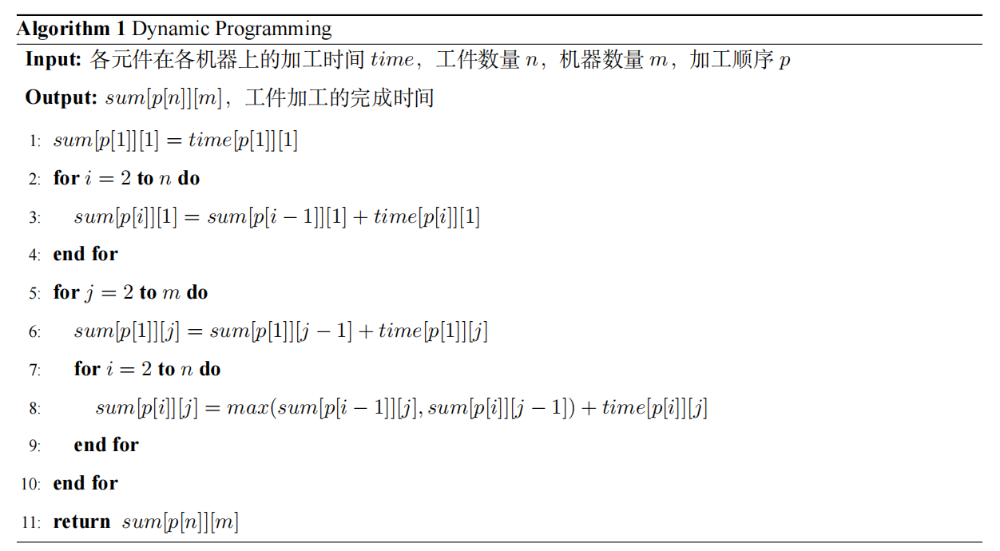
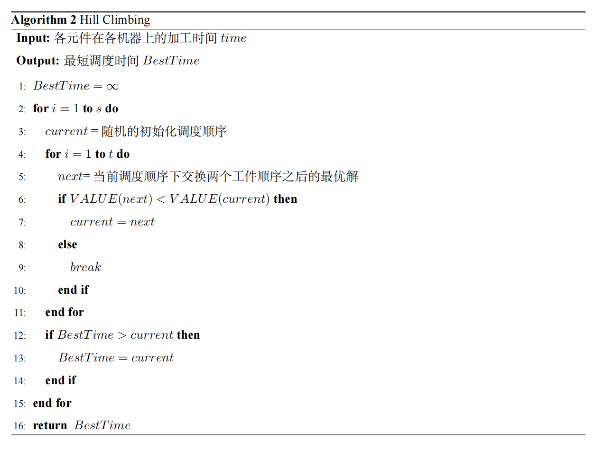
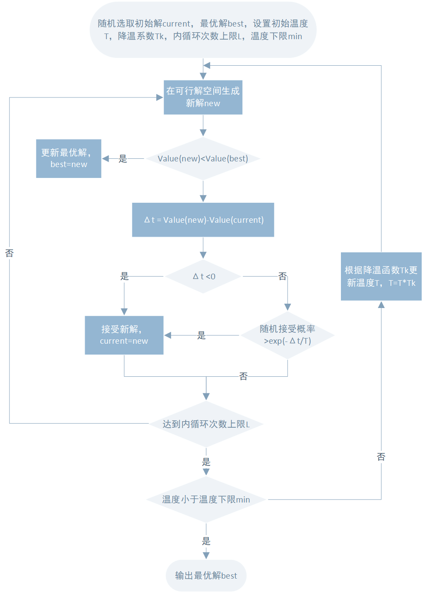
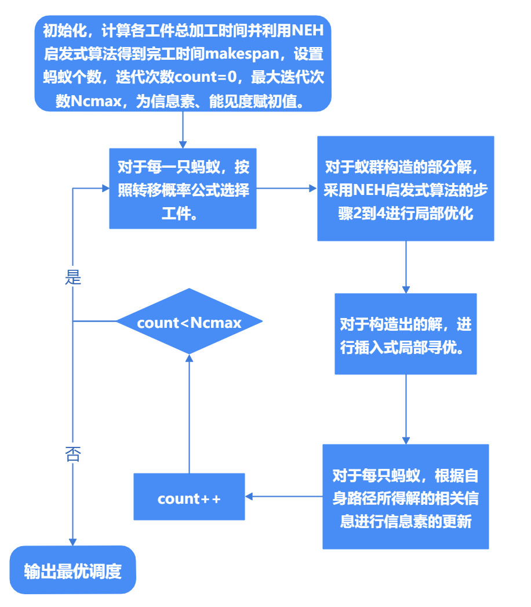
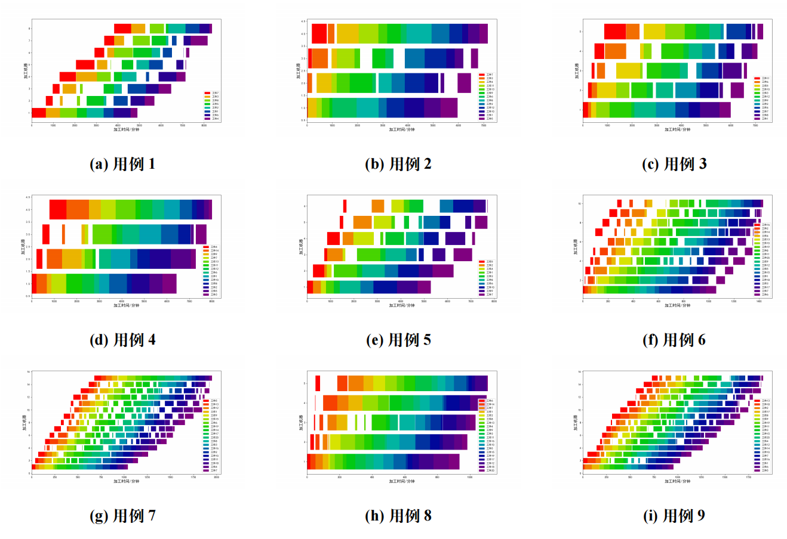

## **Permutation Flow Shop Scheduling Problem by Heuristic and Metaheuristic Algorithm**

- `optimization.cpp`: main code
- `plot.py`: main code for drawing the Gantt chart
- `paper.pdf`: report for the project
- `flowshop-test-10-students.txt`: given data for the problem
- `test.txt`: best results for each of the case in `flowshop-test-10-students.txt`

### Project introduction

- Solved the problem by Hill Climbing, Simulated Annealing (SA), NEH heuristic algorithm and Ant Clony Optimization (ACO); calculated the time cost of scheduling by Dynamic Programming.
- Modified the model to achieve better performance of SA.
- Improved the result of ACO based on the information of NEH heuristic algorithm.

### Methods

#### Dynamic Programming

#### Hill Climbing

#### Simulated Annealing

#### Ant Colony Optimization

### Results

#### Parameters

| 序号 | 内循环次数 | 初始温度 | 降温系数 | 温度下限 | 运行时间（s） |
| ---- | ---------- | -------- | -------- | -------- | ------------- |
| 0    | 1000       | 10000    | 0.99     | 1E-07    | 1.523         |
| 1    | 1000       | 10000    | 0.99     | 1E-07    | 1.648         |
| 2    | 1000       | 10000    | 0.99     | 1E-07    | 1.433         |
| 3    | 1000       | 10000    | 0.99     | 1E-07    | 1.676         |
| 4    | 1000       | 10000    | 0.99     | 1E-07    | 1.488         |
| 5    | 1000       | 10000    | 0.99     | 1E-07    | 1.54          |
| 6    | 1000       | 150000   | 0.99     | 1E-07    | 6.017         |
| 7    | 3000       | 150000   | 0.998    | 1E-06    | 126.944       |
| 8    | 1000       | 10000    | 0.99     | 1E-07    | 2.546         |
| 9    | 3000       | 150000   | 0.997    | 1E-07    | 102.665       |
| 10   | 1000       | 10000    | 0.99     | 1E-07    | 14.058        |

#### Gantt chart of the solution

